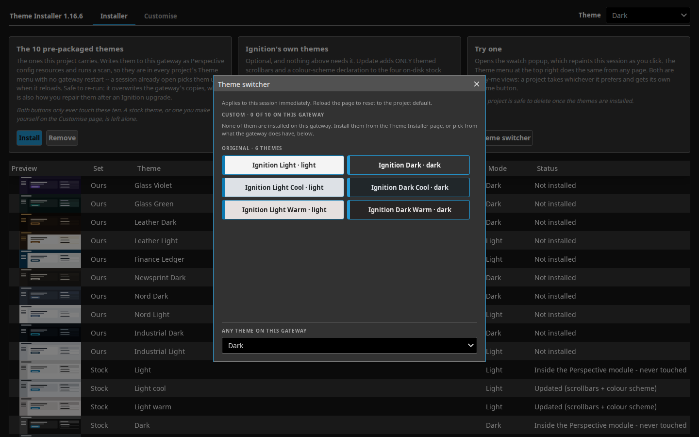

# Ignition Themes — ten Perspective gateway themes, installed by one button

| Glass Violet | Newsprint Dark | Finance Ledger |
|---|---|---|
|  |  |  |

Stock Ignition gives a Perspective session six themes, all of them variations
on the same two. This project adds ten more, as native gateway **config
resources** — so they restyle every stock Ignition component in every project
on the gateway, with no parent project, no project stylesheet and no style
classes required of the projects that use them.

They install by importing one Perspective project and pressing a button. No
filesystem access, no terminal, no gateway restart, no credential.

Two copy-me theme switchers come with them — a swatch popup and a dropdown —
and both list what the **gateway** has rather than what this repo ships, so
they work unchanged on a gateway these themes were never installed on:


## The ten themes

| Theme id | Label | Look | Mode |
| --- | --- | --- | --- |
| `glass-violet` | Glass Violet | translucent glass panels over a violet/blue/green/pink gradient field | dark |
| `glass-green` | Glass Green | translucent glass over a near-black green/teal field, bright mint accent | dark |
| `leather-dark` | Leather Dark | warm tan leather and dark paper — a book after dark | dark |
| `leather-light` | Leather Light | warm tan leather and parchment — a book in daylight | light |
| `finance-ledger` | Finance Ledger | clean, restrained ledger/spreadsheet look | light |
| `newsprint-dark` | Newsprint Dark | newsprint greys and ink on a dark page | dark |
| `nord-dark` | Nord Dark | the Nord palette, dark mode | dark |
| `nord-light` | Nord Light | the Nord palette, light mode | light |
| `industrial-dark` | Industrial Dark | industrial control-room cyan, dark mode | dark |
| `industrial-light` | Industrial Light | industrial control-room cyan, day mode | light |

Every theme covers the whole meaningfully-themeable variable surface — 110 of
the gateway's 120 built-in custom properties, audited against a live 8.3.8
gateway rather than guessed — not just the handful of headline colours. Every
theme declares `color-scheme` for its own mode, so Chrome's auto dark mode
does not repaint chart SVGs white on a dark theme.

`out/themes.json` carries the same list as data (`id`, `label`, `dark`,
`source_pack`) for anything that wants to build a picker from it.

## Installing on a gateway

### The Theme Installer project (easiest)

Import one project and press one button. `Theme_Installer-<VERSION>.zip` comes
with each release; it embeds every theme's files as data inside a
gateway-scope script, so importing the project *is* shipping the payload:

1. Gateway web UI → **Config → Projects → Import**, pick
   `Theme_Installer-<VERSION>.zip`.
2. Open `<gateway>/data/perspective/client/Theme_Installer`.
3. Click **Install all themes**. It writes the files and runs the config scan
   itself — there is no separate "Scan File System" step.
4. The page's table updates itself: the Status column flips to "Installed" for
   all ten rows once the scan lands, a couple of seconds later.
5. Optional: delete the `Theme_Installer` project afterwards. It is
   parent-free and self-contained, and removing it does not touch the themes
   it wrote — those are gateway config resources, not project resources.

Re-running **Install custom themes** overwrites whatever is on the gateway
with the embedded copies, so importing a newer release and pressing the button
again is also the repair path if an Ignition upgrade ever damages an installed
theme. Verified: a hand-corrupted `glass-green` variable was restored on disk
and in the served CSS by one press. Installing never touches a stock theme,
and the table says so per row.

**Uninstalling**: the same page's **Remove custom themes** goes through
`system.config.delete()`, which removes the resource and its files in one
call, with no scan needed.

**Trying them on**: once installed, the same page gives two ways to switch
live in your own session, with no reload and no picker to build — the
**Theme switcher** popup of swatches, and the **Theme** dropdown beside it.

The project carries four more pages, linked from each header. None is needed
to install anything; they exist so the themes are not a black box on someone
else's gateway. The first two are for anyone, the last two for people building
on them:

* **The themes** — twelve miniature plant screens, each drawn in one theme's
  own colours: Ignition's light and dark at the top, then the ten this project
  installs. It answers "what is this?" without a sentence being read.
* **How it works** — Ignition draws every screen from a palette of named
  colours; a theme re-points those names. One before/after pair and three
  steps (install, pick, change your mind).
* **Under the hood** — the measured diff against the stock theme underneath:
  108 of Ignition's variables repainted on a typical theme, 12 left untouched,
  42 added, each grouped by what it affects and shown with a swatch.
* **For builders** — the `--st-*` tokens and `st/...` classes a project can
  use without inheriting anything. See "The style-class contract" below.

The two preview pages are drawn from the theme files the installer already
embeds, so they show exactly what pressing Install produces, with no gateway
round-trip. The two measurement pages read the gateway live: they fetch the
resolved stylesheet the browser is really being served
(`/data/perspective/themes/<id>.css`, which is also how the stock base is
read, since `light` and `dark` live inside the Perspective module rather than
on disk) and measure it. No figure on either page is written down at build
time, so neither can drift from what is installed — and a theme edited on the
gateway shows its edits.

#### Updating the stock themes (optional)

Ignition's stock themes ship no scrollbar styling and no `color-scheme`
declaration, so a dark stock session shows the OS's light scrollbar and
Chrome's auto dark mode can repaint SVG fills. **Update stock themes** adds
exactly those two things to the four on-disk stock variants (`light-cool`,
`light-warm`, `dark-cool`, `dark-warm`) as one `theme-additions.css` plus one
`@import` line appended to each variant's `index.css`. Their look does not
change — verified, the served CSS diff is purely the appended block — and the
additions read the variant's own `var(--border)` so the scrollbar matches each
variant. **Restore stock themes** deletes the file and the line, verified
byte-identical served CSS afterwards.

`light` and `dark` live inside the Perspective module jar with no files on
disk, so they are never touched; pick `light-cool`/`dark-cool` to get the
additions.

Upgrades were tested empirically on a throwaway gateway, 8.3.8 → 8.3.9 on the
same data volume: the custom themes and the updated stock variants all
survived intact. A future version that ships changed stock themes may still
replace the variants' files — if a variant's row ever drops back to "Stock -
not modified", press **Update stock themes** again.

### Installing the files directly

Prefer this route to inspect or script the install without a Gateway UI
round-trip, or to deploy to several gateways from one place. `install.sh` has
three modes:

```bash
# Local filesystem -- e.g. a mounted docker volume
./install.sh --data-dir /path/to/ignition/data

# A running Ignition docker container
./install.sh --docker <container-name>

# A remote gateway over ssh (key-based auth; data-dir is on the REMOTE host)
./install.sh --ssh gateway.example.com --data-dir /path/to/ignition/data
```

Each mode copies every theme directory next to `install.sh` into:

```text
<data-dir>/config/resources/core/com.inductiveautomation.perspective/themes/<theme-id>/
```

replacing any existing directory of the same name (idempotent — safe to
re-run). It tries to match ownership to the gateway's own `light-cool`
directory; if it cannot detect that, it leaves ownership alone rather than
guess. It refuses to touch `light`, `dark`, `light-cool`, `light-warm`,
`dark-cool` or `dark-warm` under any circumstances.

**Manual alternative** — if you would rather not run a shell script against a
gateway you do not fully trust yet, copy each theme folder yourself to the
same destination path, preserving the five files inside each (`config.json`,
`index.css`, `variables.css`, `globals.css`, `resource.json`), then match
ownership to a sibling shipped theme directory by hand.

Then run the scan, and verify:

#### Scan — the CONFIG scan, not the Projects one

Themes are gateway **config resources**, not project resources. In the gateway
web UI: **Config → Platform → Overview → "Scan File System"**. This is a
*different* button from the Projects page's own "Scan File System" — that one
only picks up project resources (views, scripts, style classes) and will not
register a new theme.

**No gateway restart is required.** Despite what the 8.1 and 8.3 docs say
about a new theme needing a restart before it is selectable, this was tested
end to end on Ignition 8.3.8: a brand-new theme dropped under
`config/resources/.../themes/` and registered with a single config scan served
immediately, and was selectable in the same session. `docs/THEMES-EVALUATION.md`
has the full writeup.

#### Verify

```bash
curl -s -o /dev/null -w '%{http_code}\n' https://<gateway>/data/perspective/themes/<theme-id>.css
```

should return `200` for each installed theme id.

#### Uninstall

Delete each theme's directory under `.../themes/<theme-id>/` and run the same
Overview config scan again. There is no separate gateway-side registry to
clean up — the config resource *is* the directory.

### Selecting a theme

A Perspective session's theme is `session.props.theme` — bindable and
session-wide, as opposed to the page-scoped `system.perspective.setTheme()`. A
minimal dropdown bound to it:

```json
{
  "type": "ia.input.dropdown",
  "props": {
    "options": [
      {"label": "Glass Violet", "value": "glass-violet"},
      {"label": "Glass Green", "value": "glass-green"},
      {"label": "Leather Dark", "value": "leather-dark"},
      {"label": "Leather Light", "value": "leather-light"},
      {"label": "Finance Ledger", "value": "finance-ledger"},
      {"label": "Newsprint Dark", "value": "newsprint-dark"},
      {"label": "Nord Dark", "value": "nord-dark"},
      {"label": "Nord Light", "value": "nord-light"},
      {"label": "Industrial Dark", "value": "industrial-dark"},
      {"label": "Industrial Light", "value": "industrial-light"}
    ]
  },
  "propConfig": {
    "props.value": {
      "binding": {
        "type": "property",
        "config": {
          "path": "session.props.theme",
          "bidirectional": true
        }
      }
    }
  }
}
```

`out/themes.json` carries the same id/label/dark-flag list as data, if you
would rather build the options from a script than hand-write them. Or use one
of the two switchers below, which build the list from the gateway itself.

## Adding a theme switcher

`Theme_Installer` ships **two**, either of which drops into any project to let
a user change their own session's theme, with no parent project and no style
classes:

- **`views/ThemeDropdown`** — one 34px dropdown. Embed it with an Embedded
  View component (`props.path = "ThemeDropdown"`, about 260×34) and that is the
  whole job.
- **`views/SelectorPopup`** — the swatch grid, opened as a popup. Each theme is
  a button in its own colours, so you can see what you are picking.

**Both list the gateway, not this repo.** Each asks
`system.config.getResources(moduleId="com.inductiveautomation.perspective",
typeId="themes")` when it opens, and adds Ignition's stock six as a fixed base
(`light` and `dark` live inside the Perspective module's jar and never appear
as resources). So a switcher copied onto a gateway that has none of these
themes offers that gateway's own themes instead of writing an id Perspective
cannot resolve, and a theme from anywhere else shows up without either file
being edited.

The popup's swatch colours are a fixed hand-verified list — a view binding
cannot read a colour out of a theme's CSS — but a swatch is only *offered*
when the gateway has that theme, the section heading counts what is there,
and when none are, a line says so and points at the dropdown at its foot:



Neither view depends on a script package: the listing is inline in each,
duplicated on purpose so that copying one drags nothing else in.

To use the popup in another project:

1. Copy the whole `views/SelectorPopup` directory into the target project (or
   lift it from `selector-popup/SelectorPopup.view.json` here).
2. Add a button anywhere that calls:
   ```python
   system.perspective.openPopup(
       'theme-selector',
       'SelectorPopup',
       title='Theme switcher',
       modal=True,
       draggable=True,
       resizable=False,
       overlayDismiss=True,
       viewportBound=True,
       position={'width': 560, 'height': 590})
   ```
   `width`/`height` are **not** top-level `openPopup` kwargs on this Ignition
   version — confirmed live and against IA's own scripting reference. They go
   inside `position` as plain pixel integers. `viewportBound=True` keeps the
   frame fully on-screen on a short viewport.

That is it — the popup writes `session.props.theme` itself when a swatch is
clicked; nothing else needs wiring up.

Both views are hand-authored and commit-tracked at
`selector-popup/SelectorPopup.view.json` and
`selector-popup/ThemeDropdown.view.json`; `build_installer.py` copies them into
the generated project verbatim, and only their `resource.json` is built fresh
each run.

## What a theme covers

### Variable coverage

Audited 25/08/2026 directly against a live 8.3.8 gateway
(`curl http://<gw>/data/perspective/themes/{dark,light}.css`, every
`--name: value;` enumerated): the flattened theme CSS defines exactly **120**
unique custom properties each. Every theme here covers **110** of them.

Beyond the core ~35 surfaces, borders, ink, accent, status, radius and
elevation variables, the generator derives:

- **Neutral midtones**: `--neutral-40/50/60/70/80`, interpolated (RGB lerp,
  evenly spaced) between the pack's own `--neutral-30` and `--neutral-90` — no
  source token supplies these directly. Added because the audit found ~98
  component rules across `dark.css`/`light.css` reference these *directly*
  (icon fills and strokes, secondary text, hairline borders, SVG symbol
  strokes), not merely as indirection behind variables already covered.
  Leaving them unthemed left a large swath of secondary chrome stock grey
  regardless of theme.
- **Controls**: `--checkbox--checked/unchecked/indeterminate/disabled`,
  `--radio--selected/unselected/disabled`,
  `--toggleSwitch--selected/unselected`,
  `--progressLinearBar--determinate/indeterminate`,
  `--progressLinearTrack--determinate/indeterminate`. All names confirmed
  against the live CSS — an earlier pass guessed `--radio--checked/unchecked/
  indeterminate` and `--toggleSwitch--on/off/disabled` by symmetry with
  `--checkbox--*`; the real names differ, and there is no
  `--radio--indeterminate` or `--toggleSwitch--disabled` at all.
- **Status secondaries**: `--warningSecondary`, `--infoSecondary` — `--warning`
  and `--info` re-emitted as a 16%-alpha wash.
- **P&ID symbols**: `--symbolFill--default/running/faulted/stopped` and
  matching `--symbolStroke--*` (the fill darkened 20%, for a visible outline
  against its own fill; `default` reuses `--containerBorder`).
  `--symbolFillAnimation--default/running` reuse `--neutral-80`, as IA's own
  values for both do.
- **Native pipes**: `--pipeStroke`, `--pipePrimaryFill`, `--pipeSecondaryFill`,
  `--pipeSelectStroke`.
- **Chart scales**, generated algorithmically (standard-library `colorsys`, not
  read from any source pack — none defines a 10/16/6-step scale), anchored on
  the theme's own final `--callToAction`/`--error`/`--neutral-10`, and
  deterministic:
  - `--qual-1..10`: ten hues rotated evenly around the wheel, `--qual-1` being
    the accent hue itself; lightness ~65% / saturation 60% on dark themes,
    ~46% / 60% on light.
  - `--seq-1..6`: a monotonic ramp of the accent hue, weak → strong.
  - `--div-1..16`: a diverging ramp from the accent hue through a neutral
    midpoint matched to the page to the error hue.
  - Every `--qual-*` is checked (warn-only) for contrast ≥1.5 against
    `--neutral-10` and RGB distance ≥40 from its neighbour, wraparound
    included. All ten themes pass with zero chart-scale warnings.
- **Two variables IA's own themes never define at all**:
  `--tooltip-background-color` and `--arrow-color` are referenced by
  `.ia_form__tooltip-*` rules via `var()` with no fallback and no `:root`
  value anywhere in IA's CSS, so a stock tooltip's background and arrow are
  effectively unset. Every theme here gives them a real value.
- **Misc**: `--boxShadow--inset`, `--indicator` and `--indicatorOff` (the LED
  component's diode and the quality-overlay pending state),
  `--contextBackground`, `--defaultSliderFocusColor`,
  `--callToAction--activeAlt` and `--activeAltInvis`.

**Deliberately left inherited** — the remaining 10 of the 120, geometry or
pure IA brand constants rather than colours a theme should own: `--white`,
`--black`, `--font-NotoSans`, `--opacity-25/50/85`, `--red-10/20/30/50/60`,
and `--defaultSliderFocusBoxShadow` (a pure blur/spread value with no colour
component — its colour half, `--defaultSliderFocusColor`, *is* themed).

### Compensating rules for hard-coded IA colours

The same audit scanned the live flattened CSS for colour literals applied
directly to a component selector rather than through a variable. A handful of
IA's own rules bypass the variable system entirely, so **no** theme — IA's own
built-in ones included — can reach them by overriding `variables.css` alone.
Each theme's `globals.css` adds three targeted compensating rules, judged
common, visible and low-risk enough to be worth it — the same selectors IA
itself defines, at the same alpha steps, just with the theme's own accent:

- **`::selection`** — IA's `dark.css` hard-codes a fixed dark blue and
  `light.css` defines none at all (browser default). Tinted with the theme's
  own accent at 0.35 alpha.
- **`.ia_slider__handle:focus`** — hard-codes its own blue `color` directly
  rather than reading `--defaultSliderFocusColor`, the way IA's *other* slider
  implementation does. Swapped to read the variable properly.
- **Table row hover and selection** (`.ia_tableComponent__body__row--hovered`,
  `.ia_tableComponent__selection`, `.ia_alarmJournalTableComponent__selection`,
  `.ia_alarmStatusTableComponent__selection`) — the highest-traffic hard-code
  found, since every table hits it. `!important` here because IA's own
  declarations carry the same specificity and would otherwise win on source
  order alone from within the same imported base stylesheet.

Separately, and by the same `globals.css` mechanism, **scrollbars follow the
theme**: `scrollbar-color` and the `::-webkit-scrollbar-*` rules use the
theme's own `--containerBorder` for the thumb and `--callToAction` on hover,
since stock themes leave scrollbars at browser default regardless of theme.

### The occlusion-fix rule

Every `globals.css` emits, alongside the page background:

```css
#app-container .center.view-parent > .view.ia_container--root {
  background-color: transparent !important;
}
```

Perspective's own top-level view root — the element carrying both `.view` and
`.ia_container--root` — paints itself opaque with the theme's own
`--containerRoot`, one level inside `#app-container`. That is stock behaviour
for any `ia_container--primary` root container, not a bug in any project's
view JSON, and it hides the page background on every ordinary page in every
theme unless punched through. The selector is a structural Perspective shell
pattern rather than something specific to one theme, so the fix generalises
unchanged across all ten.

## The style-class contract

A theme is CSS only, and the conventional reading is that it therefore cannot
ship Perspective style classes. The first half is true; the conclusion is not,
and the difference is what lets a project drop a look-and-feel parent
entirely.

**Perspective emits whatever string sits in `style.classes` into the DOM as a
`psc-<string>` class, resource or no resource.** So a theme's `globals.css` —
just CSS served gateway-wide — can define `.psc-st\/containers\/card` and carry
a whole semantic class contract. What is lost is only the Designer's
style-class picker dropdown, which costs nothing for a UI that is generated
rather than hand-assembled.

`build_contract.py` appends that payload to each theme's `globals.css`, in
cascade order:

1. the theme's 40 `--st-*` tokens, hoisted to `:root`;
2. `contract/chrome.css` verbatim — component chrome, shell and card grid,
   written against `[class*="/family/name"]` attribute selectors;
3. the 69-class contract, from each class's own definition.

Two things worth knowing if you build on it or extend it:

**Keep the slashes.** `st/containers/card`, not `st-containers-card`. Part 2 is
keyed on `[class*="/tables/frame"]`-style attribute selectors, and slash names
let 585 lines of chrome port byte for byte.

**Double the selector; never use `!important`.** A theme loads *before* IA's
own `PerspectiveComponents.css`, whereas a project style-class bundle loads
*after* it — so moving a contract into a theme flips it from winning ties to
losing them. Measured: `buttons/chip` silently dropped its `padding: 0 12px`
to IA's `0`. `!important` fixes that but also beats *inline* styles, which
inverts Perspective's own precedence and breaks every per-component override
(measured: it forced topbar and sidebar padding over the components' own
props). Doubling the class — `.psc-st\/x\/y.psc-st\/x\/y`, specificity 0-2-0 —
beats IA's 0-1-0 component rules and still loses to inline, which is exactly
how a real style class behaves.

The installer's "For builders" page lists every token and class a project can
use, read from the gateway live.

## Building from source

```bash
python3 build_theme.py       # regenerate out/ (always wipes + rebuilds)
python3 build_installer.py   # regenerate installer-project/ from out/
./package.sh                 # -> dist/ignition-themes-<VERSION>.zip
                             # -> dist/Theme_Installer-<VERSION>.zip
```

No third-party dependencies — the chart-scale generator uses only the
standard library. `build_theme.py` wipes and rewrites everything under `out/`,
so a rename can never leave a stale directory under an old theme id sitting
beside the new one. It prints:

- a `WARNING` line for every mapping entry that needed a fallback source,
  bottomed out at a `literal:` default, or produced a chart colour with poor
  contrast against the page or too close to its neighbour;
- a `TWEAK` line per theme listing which variables a `TWEAKS` entry overrode;
- a `SWATCH` line per theme with the ten `--qual-*` hex values, for eyeballing
  hue spread.

It exits non-zero only on a hard error — a `mapping.py` entry whose whole
fallback chain resolved to nothing, which is an authoring bug in the generator
rather than a finding about a source pack.

`VERSION` is a plain one-line file, bumped by hand before packaging; neither
`build_installer.py` nor `package.sh` touches it. `package.sh` refuses to run
if `out/`, `out/themes.json` or
`installer-project/Theme_Installer/project.json` is missing, rather than
silently packaging a stale or empty `dist/`.

### What is where

- `packs/` — the ten source colour packs, each a JSON token set.
- `mapping.py` — the curated token → built-in-Perspective-variable table, in
  three parts (read its module docstring for the full grammar):
  - `MAPPING`, the core ~35 IA variables, resolved straight from a pack;
  - `EXTENDED_MAPPING`, a second pass resolved after `MAPPING` and any
    `TWEAKS`, so it can `ref:` the final values;
  - `TWEAKS`, per-theme literal overrides — data, not code — applied between
    the two passes. Only `glass-green` has an entry today.
- `build_theme.py` — the generator: resolves `MAPPING` against the pack,
  applies `TWEAKS[id]`, resolves `EXTENDED_MAPPING`, generates the three chart
  scales, writes `out/<id>/`.
- `build_contract.py` — appends the `--st-*` / `st/...` contract payload to
  each theme's `globals.css`. Its inputs are vendored under `contract/`.
- `build_installer.py` — regenerates `installer-project/Theme_Installer/` from
  scratch, embedding every theme's file contents as data in a gateway-scope
  script (`ignition/script-python/themepack/code.py`). Data-dir resolution is
  `IgnitionGateway.get().getSystemManager().getDataDir()`, verified live on
  8.3.8. Install writes the files then requests one config scan; uninstall
  goes through `system.config.delete()` instead. Every write is whitelisted
  against whatever `out/` held at build time — there is no code path that can
  reach `light`, `dark`, `light-cool`, `light-warm`, `dark-cool` or
  `dark-warm`.
- `out/<theme-id>/` — the ten generated theme directories, each with
  `config.json`, `index.css`, `variables.css`, `globals.css` and
  `resource.json`. This is exactly what gets deployed to
  `data/config/resources/core/com.inductiveautomation.perspective/themes/<id>/`.
- `insight/` — the capture scripts used to read a live gateway's stock
  palettes for the audits above.
- `docs/THEMES-EVALUATION.md` — the evaluation this project grew out of: what
  a theme can and cannot reach, whether themes paint earlier than a project
  stylesheet, and what a look-and-feel parent still buys on top of one.

`resource.json` deliberately carries no `lastModification` or
`lastModificationSignature`. The gateway must stamp those itself on first
scan — a hand-written signature that does not match the content makes the
config scan **silently** skip the resource.

### The glass-green tweak

`glass-green` (source pack `aurora-teal`) originally read as *violet with a
teal accent* rather than a genuine green-glass theme. Root cause: the pack's
`surface.page`/`surface.card`/`surface.sidebar` tokens were never diverged
from `aurora-violet` when the pack was cloned — both packs' `surface.page` is
the literal `"#1a1233"`, violet. Only the accent-adjacent tokens actually
changed. A stylesheet-based renderer never showed this, because it reads
`containers/page`'s *effective* `backgroundColor` override (already a correct
dark teal) rather than the raw `surface.page` token; this generator reads the
raw token, which is what let the violet leak through into a *theme*
specifically.

Fixed entirely in `mapping.TWEAKS["glass-green"]` — `packs/aurora-teal.json`
is untouched. The tweak recomputes the surface stack from a new near-black
green-tinted base (`#0d1412`) using the pack's own existing translucent
white-glass alpha values, so the *glass effect* is unchanged and only what it
sits on differs, and moves the accent from the pack's muted teal (`#0f766e`)
to a brighter mint (`#2dd4bf`, hover `#5eead4`, active `#26b4a2`) with a fresh
green `--success`. Every downstream variable that `ref:`s the accent, plus the
chart scales and the compensating rules, inherits the fix automatically.
`glass-violet` has no tweak and is unmodified.

## Boundaries

Worth knowing before you adopt these, and none of it is fixable from a theme:

- **Elevation is one shadow across five slots.** `--boxShadow1..5` all take a
  single value, and `none` for the packs that declare no shadow token at all
  (`leather-dark`, `industrial-dark`, `industrial-light` — deliberate in
  leather's case, which reads as a flat page rather than a dashboard with
  elevation). `--boxShadow--inset` inherits the same limitation. No source
  pack defines a finer 1–5 elevation scale to derive from.
- **A heading serif face is unreachable.** Leather's Crimson Pro/Georgia
  heading face has no path to Perspective's `ia.display.label` components from
  a theme alone — confirmed against the live DOM, where `ia.display.label`
  always renders as `<div class="ia_labelComponent"><span>` and never a
  semantic heading element.
- **The Equipment Schedule / Gantt component is entirely hard-coded.** Its
  progress bar fill and track, tooltip, schedule-event blocks, lead-time
  shading, move and selected placeholders, downtime and break-period washes
  are all fixed colours regardless of theme. If your project uses it, expect
  it to look the same IA purple/blue/peach under every theme here, and under
  the stock ones too.
- **Other lower-traffic hard-codes are left as IA constants**: generic black
  elevation shadows across alarm table panels, the pager, table head and foot
  containers, the toggle-switch thumb, editable table cells and form tooltips
  (neutral black in IA's own themes too, so consistent with everything else);
  the date-range picker's day-hover tint;
  `.ia_form__actionBar--fixed`'s hairline border; and the video player's
  control-popup background, which is deliberately black to match the
  convention most video players use regardless of surrounding theme.

## Upgrade risk

Custom-named themes are low risk: the Perspective module's upgrade migrator
only manages the bundled names (`light`, `dark`, and the four shipped
variants) and never touches a custom directory. A theme installed here lives
only on the gateway it was installed to, unless you also keep a copy
elsewhere — git, a backup, or a release zip.

## Licence

Apache-2.0. See [LICENSE](LICENSE).
