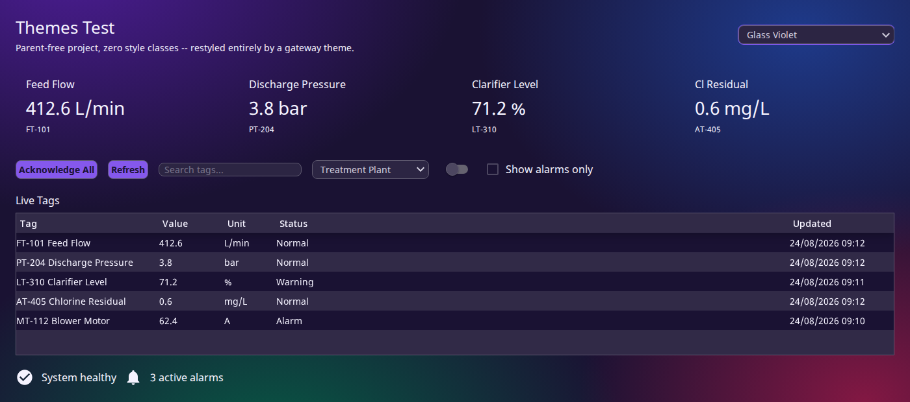
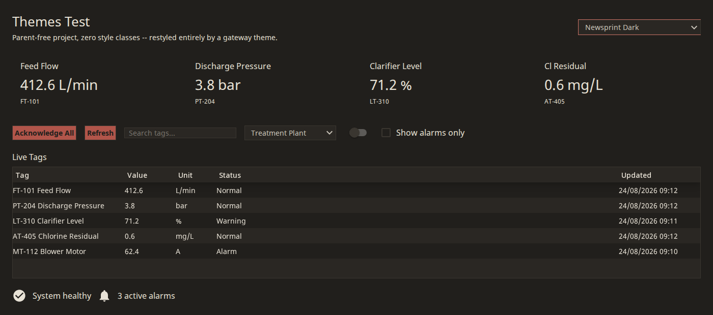
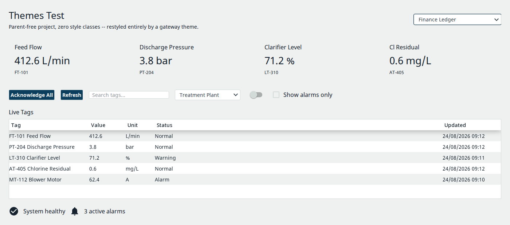
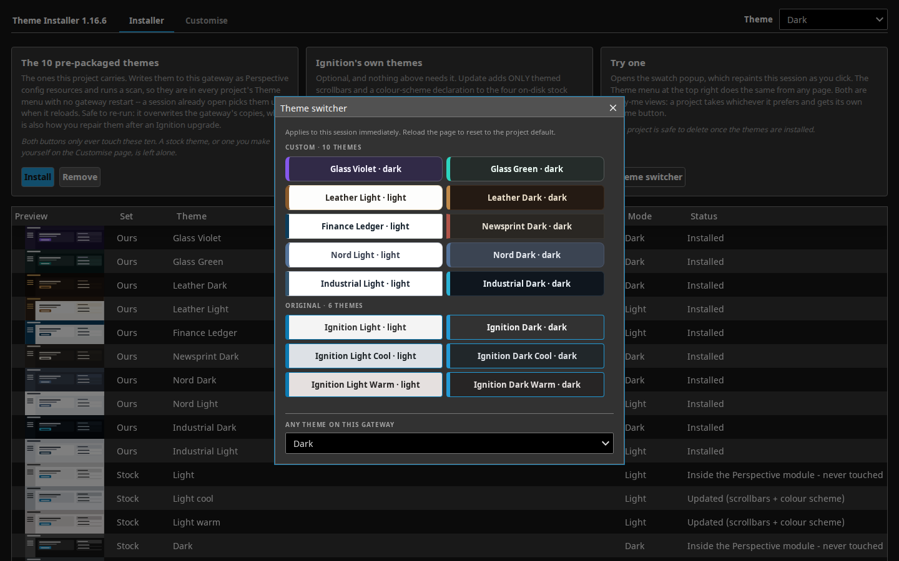

# Theme generator — 10 curated packs as Perspective gateway themes

| Glass Violet | Newsprint Dark | Finance Ledger |
|---|---|---|
|  |  |  |

The included switcher popup (copy `views/SelectorPopup` into any project):



Delivers 10 existing packs as Perspective gateway **themes** (a config resource,
distinct from this repo's usual project-stylesheet-plus-style-class delivery).
Started as a 2-pack throwaway experiment (`test-aurora-violet` /
`test-leather-night-tan`, evaluated in `docs/THEMES-EVALUATION.md` — read that
first for the verdicts on "themes free the stylesheet", "no parent needed",
"themes paint earlier", and what a template parent still buys), graduated to 9
real theme names one per curated pack, picked up simple final names and a fix
for one theme that was reading wrong (Nigel's 24/08/2026 review), and then —
25/08/2026, ahead of cutting a distributable release — was audited against a
live gateway's actual flattened theme CSS for complete coverage. It now ships
as `gaskony-themes-<VERSION>.zip` (`package.sh`, `install.sh`,
`RELEASE-README.md`, `VERSION` — see "Releasing" below).

**This is still NOT part of the packs/families source-of-truth pipeline.** It
is never read or written by `tools/build_all.py`, and nothing under
`Styles_Template2/`, `Styles_Example2/`, `tools/`, `packs/` or `families/` is
touched by anything in this directory. `mapping.py` and `build_theme.py` only
*read* files under `packs/`.

## The 10 themes

Theme **id** is now Nigel's exact name, independent of the source pack's own
id/label — kept traceable via the table below and via `out/themes.json` (a
LABELS index: id, label, dark flag, source pack) and via the source-pack
comment at the top of each generated `variables.css`:

| Theme id | Label | Source pack | dark/light | base import |
| --- | --- | --- | --- | --- |
| `glass-violet` | Glass Violet | `aurora-violet` | dark | `../dark/index.css` |
| `glass-green` | Glass Green | `aurora-teal` (TWEAKED — see below) | dark | `../dark/index.css` |
| `leather-dark` | Leather Dark | `leather-night-tan` | dark | `../dark/index.css` |
| `leather-light` | Leather Light | `leather-parchment-tan` | light | `../light/index.css` |
| `finance-ledger` | Finance Ledger | `finance-ledger` | light | `../light/index.css` |
| `nord-dark` | Nord Dark | `nord-dark-frost` | dark | `../dark/index.css` |
| `nord-light` | Nord Light | `nord-light-frost` | light | `../light/index.css` |
| `industrial-dark` | Industrial Dark | `industrial-control-cyan` | dark | `../dark/index.css` |
| `industrial-light` | Industrial Light | `industrial-day-cyan` | light | `../light/index.css` |

Only `finance-ledger` has id == pack id. Each pack's own `"dark"` flag decides
the base import and the `color-scheme` declared in `variables.css` — read per
pack, never assumed from the name (`finance-ledger` reads `false` despite
sounding neutral).

`out/` is wiped and rebuilt from scratch on every run, so a rename can never
leave a stale directory under an old theme id sitting next to the new one.

## Contents

- `mapping.py` — the curated token → built-in-Perspective-theme-variable
  table, in three parts (read its module docstring for the full grammar):
  - `MAPPING` — the core ~35 IA variables (surfaces, borders, ink, accent,
    status, radius, elevation), resolved straight from a pack.
  - `EXTENDED_MAPPING` — a second pass, resolved after `MAPPING` (and any
    `TWEAKS`) so it can `ref:` the final values: the neutral midtones,
    controls, status-secondary washes, symbols, pipes, a few misc vars. See
    "Full variable coverage" below.
  - `TWEAKS` — per-theme-id literal overrides (data, not code) applied
    between the two passes. Only `glass-green` has an entry today. See
    "The glass-green tweak" below.
- `build_theme.py` — the generator. For each entry in `THEMES` (id, label,
  source pack): resolves `MAPPING` against the pack → applies
  `TWEAKS[id]` if present → resolves `EXTENDED_MAPPING` → generates the three
  chart scales algorithmically (`colorsys`, see below) → writes `out/<id>/`.
  Its `flatten()`/`parse_colour()` are copied verbatim from
  `tools/build_css.py` (with a comment saying so) rather than imported, per
  this experiment's standing constraint of not depending on `tools/`.
  `globals.css` is GENERATED generically (page background from the pack's own
  `overrides["containers/page"]`, or from `TWEAKS[id]["globals"]` when
  present, plus the occlusion-fix rule, theme-following scrollbars, and the
  hard-coded-colour compensating rules — see below for each).
- `out/<theme-id>/` — the 10 generated theme directories, each with
  `config.json`, `index.css`, `variables.css`, `globals.css`,
  `resource.json`. This is exactly what gets deployed to
  `data/config/resources/core/com.inductiveautomation.perspective/themes/<id>/`
  on a gateway.
- `out/themes.json` — `[{id, label, dark, source_pack}, …]` for whatever
  selector UI needs the list (e.g. a theme picker view).
- `VERSION`, `package.sh`, `install.sh`, `RELEASE-README.md` — the release
  pack. See "Releasing" below.
- `build_installer.py` / `installer-project/Theme_Installer/` — a second,
  self-contained install path: a parent-free Perspective project that embeds
  every theme's file contents (read from `out/`, whatever count that is at
  build time) as data in a gateway-scope script
  (`ignition/script-python/themepack/code.py`), plus a one-page UI
  (`views/Installer`) with Install/Remove buttons, a live status table, and a
  "Theme switcher" button that opens `views/SelectorPopup` — a hand-authored,
  commit-tracked copy-me popup (`selector-popup/SelectorPopup.view.json`, NOT
  generated from `out/`, so it does not auto-track a theme count change —
  see that file's own README for the swatch list) for previewing every
  custom theme + the 6 IA built-ins live. See
  "Adding the theme selector popup" below. `package.sh` zips it into
  `dist/Theme_Installer-<VERSION>.zip`, a normal
  Ignition project-import zip — see "Theme Installer project (easiest)" under
  "Installing on a gateway" below. Regenerate it after any `out/` change with
  `python3 build_installer.py` (wipes and rewrites
  `installer-project/` from scratch, same pattern as `build_theme.py`'s own
  `out/`). Data-dir resolution is
  `IgnitionGateway.get().getSystemManager().getDataDir()` (verified live on
  8.3.8 — see `tools/build_project.py`'s `verify_pack_coverage()` for the same
  call used elsewhere in this repo); install writes files then requests ONE
  config scan, uninstall goes through `system.config.delete()` instead
  (removes the resource and its files in one call, no scan needed). Every
  write is whitelisted against whatever `out/` held at build time — there is
  no code path that can reach `light`/`dark`/`light-cool`/`light-warm`/
  `dark-cool`/`dark-warm`.

## Regenerating

```bash
python3 build_theme.py
```

No third-party dependencies (the chart-scale generator uses only the
standard-library `colorsys`). It wipes and rewrites everything under `out/`.
It prints:
- a `WARNING` line for every mapping entry (core or extended) that needed a
  fallback source, bottomed out at a `literal:` default, or produced a chart
  colour with poor contrast against the page or too close to its neighbour;
- a `TWEAK` line per theme listing which vars a `TWEAKS` entry overrode;
- a `SWATCH` line per theme with the 10 `--qual-*` hex values, for eyeballing
  hue spread.

It exits non-zero only on a hard error — a `mapping.py` entry whose whole
fallback chain resolved to nothing, which is an authoring bug in this
generator, not a finding about a pack.

## The glass-green tweak

`glass-green` (source pack `aurora-teal`) was reviewed 24/08/2026 and read as
*violet with a teal accent* rather than a genuine green-glass theme. Root
cause: `aurora-teal`'s `surface.page`/`surface.card`/`surface.sidebar`/…
tokens were never diverged from `aurora-violet` when the pack was cloned —
both packs' `tokens["surface.page"]` are the literal string `"#1a1233"`
(violet). Only the accent-adjacent tokens (`accent.primary`,
`accent.progress`, `surface.nav-active`, the `containers/page` override)
actually changed. `tools/build_css.py`'s own stylesheet output never showed
this because it reads `containers/page`'s *effective* `backgroundColor`
override (already a correct dark teal) rather than the raw `surface.page`
token — this generator's `MAPPING` reads the raw token, which is what let the
violet leak through into a *theme* specifically.

Fixed entirely in `mapping.TWEAKS["glass-green"]` — `packs/aurora-teal.json`
is untouched. The tweak recomputes the whole surface stack from a new dark
near-black green-tinted base (`#0d1412`) using the pack's own existing
translucent white-glass alpha values (`rgba(255,255,255,0.06/0.08/0.10/0.14/
0.22)`, unchanged — the *glass effect* is untouched, only what it sits on),
and moves the accent from the pack's own muted teal (`#0f766e`) to a brighter
mint (`#2dd4bf` / hover `#5eead4` / active `#26b4a2`), with a fresh green
`--success` (`#4ade80`). The page background gradient is re-picked from
Nigel's named hues (`#065f46`, `#0e7490` — the one cool blue-green allowed,
`#134e4a`, `#0f766e`), same stop layout as the original aurora pattern. Every
downstream var that `ref:`s `--callToAction`/`--container`/`--border`/etc in
`EXTENDED_MAPPING`, plus the chart scales and the compensating rules below
(all anchored on the *tweaked* accent hue), inherit the fix automatically —
nothing violet survives anywhere. Full reasoning and every literal value live
as comments in `mapping.py` right above the `TWEAKS` dict.

`glass-violet` (source pack `aurora-violet`) has no tweak and is unmodified.

## Full variable coverage

**Audited 25/08/2026 directly against a live 8.3.8 gateway**
(`curl http://<gw>/data/perspective/themes/{dark,light}.css`, every
`--name: value;` enumerated): the flattened theme CSS defines exactly **120**
unique custom properties each (this supersedes an earlier exploration pass's
estimate of ~136). Every theme in this pack now covers **110** of them.

Beyond the core ~35, `EXTENDED_MAPPING` derives (all from vars `MAPPING`
already computed, so a `TWEAKS` override propagates automatically):

- **Neutral midtones**: `--neutral-40/50/60/70/80` — INTERPOLATED (RGB lerp,
  evenly spaced) between the pack's own `--neutral-30` and `--neutral-90`, no
  pack token supplies these directly. Added because the audit found ~98
  component rules across dark.css/light.css reference these DIRECTLY (icon
  fills/strokes, secondary text, hairline borders, SVG symbol strokes), not
  merely as indirection behind vars this generator already covered — leaving
  them unthemed meant a large swath of secondary chrome stayed IA-stock-grey
  regardless of pack.
- **Controls**: `--checkbox--checked/unchecked/indeterminate/disabled`,
  `--radio--selected/unselected/disabled`,
  `--toggleSwitch--selected/unselected`,
  `--progressLinearBar--determinate/indeterminate`,
  `--progressLinearTrack--determinate/indeterminate` — from `--callToAction`,
  `--border`, `--border--disabled`, and the pack's own
  `surface.progress-track`. All names CONFIRMED against the live CSS
  25/08/2026 (an earlier pass guessed `--radio--checked/unchecked/
  indeterminate` and `--toggleSwitch--on/off/disabled` by symmetry with
  `--checkbox--*` — the real names differ, and there is no
  `--radio--indeterminate` or `--toggleSwitch--disabled` at all; both were
  corrected, not merely renamed).
- **Status secondaries**: `--warningSecondary`, `--infoSecondary` — `--warning`
  / `--info` re-emitted as a 16%-alpha wash.
- **Symbols**: `--symbolFill--default/running/faulted/stopped` (container /
  success / error / muted-ink) and matching `--symbolStroke--*` (the fill,
  darkened 20%, for a visible outline against its own fill; `default` reuses
  `--containerBorder`). `--symbolFillAnimation--default/running` (a
  flow/pulse overlay) reuse the new `--neutral-80` — IA's own values for both
  are identical to its own neutral-80 too.
- **Pipes**: `--pipeStroke` (border), `--pipePrimaryFill` (muted ink),
  `--pipeSecondaryFill` (`--containerNested`), `--pipeSelectStroke` (accent).
- **Misc**: `--tooltip-background-color` and `--arrow-color` (`--containerNested`
  / `--icon`) — CONFIRMED real and, interestingly, IA's own theme CSS never
  gives either a value anywhere (`.ia_form__tooltip-*` rules reference them
  via `var()` with no fallback and no `:root` definition) — a stock IA
  tooltip's background and arrow are effectively unset, and this pack's
  themes are the only thing giving them one. `--boxShadow--inset`
  (`--boxShadow1` prefixed `inset `, or `none` unchanged). `--indicator`
  (`--success` — drives the LED component's "on" diode and the
  quality-overlay "pending" state) and `--indicatorOff` (`--indicator`
  darkened 85%, matching IA's own on/off ratio). `--contextBackground`
  (`--containerNested` — see below for why this is NOT a literal reuse of
  IA's own `--black`). `--defaultSliderFocusColor` (`--callToAction` at IA's
  own 0.5 alpha). `--callToAction--activeAlt` / `--activeAltInvis`
  (`--callToActionHighlight` / `--callToAction--hover` — IA's own values for
  these sit close enough to those two that one derivation covers both
  meaningfully; see `mapping.py`'s comments for the reasoning).
- **Chart scales** — generated ALGORITHMICALLY by `build_theme.py`
  (`colorsys`, not read from any pack — no pack defines a 10/16/6-step
  scale), anchored on the theme's own final `--callToAction`/`--error`/
  `--neutral-10`, deterministic (same inputs → same output, every run):
  - `--qual-1..10`: 10 hues rotated evenly around the wheel, `--qual-1` is
    the accent hue itself; lightness ~65% / saturation 60% on dark themes,
    ~46% / 60% on light themes.
  - `--seq-1..6`: a monotonic ramp of the *accent hue*, weak → strong
    (weak = low-contrast against the theme's own page; strong = vivid).
  - `--div-1..16`: a diverging ramp from the accent hue (strong at `div-1`)
    through a neutral midpoint matched to the page (same lightness as
    `--neutral-10`, zero saturation) to the error hue (strong at `div-16`).
  - Every `--qual-*` is checked (warn-only) for contrast ≥1.5 against
    `--neutral-10` and for RGB distance ≥40 from its neighbour (wraparound
    included) — see the `SWATCH`/`WARNING` lines from a regen. All 10 themes
    currently pass with zero chart-scale warnings.

**Deliberately still NOT overridden** — the remaining 10 of the 120: pure IA
brand/geometry constants, not colours a pack should own: `--white`, `--black`,
`--font-NotoSans`, `--opacity-25/50/85`, `--red-10/20/30/50/60`,
`--defaultSliderFocusBoxShadow` (pure blur/spread geometry with no colour
component — its colour half, `--defaultSliderFocusColor`, IS themed above).

## Compensating rules for hard-coded IA colours

The 25/08/2026 audit also scanned the live flattened CSS for colour literals
applied directly to a component selector (not through a `--var`) — a handful
of IA's own rules bypass the variable system entirely, so no theme (IA's own
built-in ones or ours) can reach them by overriding `variables.css` alone.
`build_globals()` adds THREE targeted compensating rules, judged common,
visible, and low-risk enough to be clearly worth it — the same selectors IA
itself defines, same alpha steps, just the theme's own accent instead:

- **`::selection`** — IA's dark.css hardcodes a fixed dark blue and light.css
  defines none at all (browser default). Tinted with the theme's own accent
  at 0.35 alpha.
- **`.ia_slider__handle:focus`** — hardcodes its own blue `color` directly
  rather than reading `--defaultSliderFocusColor` the way IA's *other* slider
  implementation does (`.ia_form__control .ia-slider .slider-handle:focus`,
  which our var override reaches fine). Swapped to read the var properly.
- **Table row hover/selection** (`.ia_tableComponent__body__row--hovered`,
  `.ia_tableComponent__selection`, `.ia_alarmJournalTableComponent__selection`,
  `.ia_alarmStatusTableComponent__selection`) — the highest-traffic hardcode
  found (every table hits it). `!important` because IA's own declarations
  here carry the same specificity and would otherwise still win on source
  order alone from within the SAME imported base stylesheet.

Everything else hard-coded was judged lower-traffic and/or too risky to patch
with a small generic rule, and is left as an IA constant — full list,
including an entire component (Equipment Schedule / Gantt) that hard-codes
its colours regardless of theme, is in `RELEASE-README.md`'s "What's
covered" section (the release doc carries this list since it's what an
installer actually needs to know; this repo doc points there rather than
duplicating it a third time).

Separately (not from the hard-coded-colour audit, but the same `globals.css`
mechanism): **scrollbars follow the theme** — `scrollbar-color` / the
`::-webkit-scrollbar-*` rules use the theme's own `--containerBorder` for the
thumb and `--callToAction` on hover, since stock IA themes leave scrollbars
at browser default regardless of theme.

## The occlusion-fix rule

Every `globals.css` always emits, in addition to the page background:

```css
#app-container .center.view-parent > .view.ia_container--root {
  background-color: transparent !important;
}
```

Found live against `test-aurora-violet` and `test-leather-night-tan` on the
module-testing gateway (24/08/2026, see `docs/THEMES-EVALUATION.md`):
Perspective's own top-level view root (the element carrying both `.view` and
`.ia_container--root`) paints itself opaque with the theme's own
`--containerRoot`, one level inside `#app-container` — stock IA behaviour for
any `ia_container--primary` root container, not a bug in any project's view
JSON — which hides the page background on every ordinary page in every theme
unless punched through. The selector is a structural Perspective shell
pattern, not specific to any one pack or project, so the fix generalises
unchanged to all 10 themes without a separate live check per theme.

## Installing on a gateway

*(Same content as `RELEASE-README.md`'s install section — written once and
mirrored deliberately, so this guidance is readable straight from the repo
without unzipping a release, and a release carries it without needing the
repo. `package.sh`'s header comment notes the mirror; touch both files if
this changes.)*

### 0. Theme Installer project (easiest)

If you can import a Perspective project but would rather not touch the
gateway's filesystem or open a terminal at all, skip everything below and use
`Theme_Installer-<VERSION>.zip` instead — built alongside
`gaskony-themes-<VERSION>.zip` by the same `package.sh`, from the project
`build_installer.py` generates. It embeds all 10 themes'
files as data inside a gateway-scope script, so importing the project *is*
shipping the payload:

1. Gateway web UI → **Config → Projects → Import**, pick
   `Theme_Installer-<VERSION>.zip`.
2. Open `<gateway>/data/perspective/client/Theme_Installer`.
3. Click **Install all themes**. It writes the files AND runs the config scan
   itself — no separate "Scan File System" step, nothing else to do.
4. The page's table updates itself: the Status column flips to "Installed"
   for all 10 rows once the scan lands (a couple of seconds). Cross-check with
   step 3 below if you want the `curl` version too.
5. Optional: delete the `Theme_Installer` project afterwards. It is
   parent-free and self-contained — removing it does not touch the themes it
   already wrote, because those are gateway config resources, not project
   resources.

Re-running **Install custom themes** overwrites whatever is on the gateway
with the embedded copies — so importing a newer release of the installer and
pressing the button again is the repair path if an Ignition upgrade (or
anything else) ever damages the installed themes. Verified live: a
hand-corrupted `glass-green` variable was restored on disk and in the served
css by one press. Installing the custom themes never touches a stock theme,
and the table says so per row.

**Updating the stock themes (optional, since v1.3.0)**: the stock themes ship
no scrollbar styling and no `color-scheme` declaration, so a dark stock
session shows the OS's light scrollbar and Chrome's auto dark mode can
repaint SVG fills. **Update stock themes** adds exactly those two things to
the four on-disk stock variants (`light-cool`, `light-warm`, `dark-cool`,
`dark-warm`) as one `gaskony-additions.css` plus one `@import` line appended
to each variant's `index.css` — their look does not change (verified: the
served css diff is purely the appended block), and the additions read the
variant's own `var(--border)` so the scrollbar matches each variant. **Restore
stock themes** deletes the file and the line — verified byte-identical served
css after restore. `light` and `dark` live inside the Perspective module jar
(no files on disk), so they are never touched — pick `light-cool`/`dark-cool`
to get the additions. An Ignition upgrade may replace the variants' files;
press **Update stock themes** again afterwards, same as the custom repair
path.

**Uninstalling**: open the same page and click **Remove all themes** — goes
through `system.config.delete()`, which removes the resource AND its files in
one call, no scan needed.

Prefer the `install.sh` route below if you want to inspect or script the
install without a Designer/Gateway UI round-trip, or if you're deploying to
several gateways from one place.

### 1. Install the files

Three `install.sh` modes (or copy manually — see below):

```bash
# Local filesystem -- e.g. a mounted docker volume
./install.sh --data-dir /path/to/ignition/data

# A running Ignition docker container
./install.sh --docker ignition-module-testing

# A remote gateway over ssh (key-based auth; data-dir is on the REMOTE host)
./install.sh --ssh gateway.example.com --data-dir /path/to/ignition/data
```

Each mode copies every theme directory next to `install.sh` into:
```text
<data-dir>/config/resources/core/com.inductiveautomation.perspective/themes/<theme-id>/
```
replacing any existing directory of the same name (idempotent — safe to
re-run). It tries to match ownership to the gateway's own `light-cool`
directory; if it can't detect that, it leaves ownership alone rather than
guess. It refuses to touch `light`, `dark`, `light-cool`, `light-warm`,
`dark-cool`, `dark-warm` under any circumstances.

**Manual alternative** — if you'd rather not run a shell script against a
gateway you don't fully trust yet, copy each theme folder yourself to the
same destination path, preserving the four files inside each (`config.json`,
`index.css`, `variables.css`, `globals.css` — plus `resource.json`), then
match ownership to a sibling shipped theme directory by hand.

### 2. Scan — the CONFIG scan, not the Projects one

Themes are gateway **config resources**, not project resources. In the
gateway web UI: **Config → Platform → Overview → "Scan File System"**. This
is a *different* button from the Projects page's own "Scan File System" —
that one only picks up project resources (views, scripts, style classes) and
will not register a new theme.

**No gateway restart is required.** Despite what the 8.1 and 8.3 docs say
about a new theme needing a restart before it's selectable, this was tested
end-to-end on Ignition 8.3.8: a brand-new theme dropped under
`config/resources/.../themes/` and registered with a single config scan
served immediately and was selectable in the same session — see
`docs/THEMES-EVALUATION.md` for the full writeup.

### 3. Verify

```bash
curl -s -o /dev/null -w '%{http_code}\n' https://<gateway>/data/perspective/themes/<theme-id>.css
```
should return `200` for each installed theme id.

### 4. Select a theme

A Perspective session's theme is `session.props.theme` (bindable,
session-wide — not page-scoped, that's `system.perspective.setTheme()`
instead). A minimal dropdown bound to it:

```json
{
  "type": "ia.input.dropdown",
  "props": {
    "options": [
      {"label": "Glass Violet", "value": "glass-violet"},
      {"label": "Glass Green", "value": "glass-green"},
      {"label": "Leather Dark", "value": "leather-dark"},
      {"label": "Leather Light", "value": "leather-light"},
      {"label": "Finance Ledger", "value": "finance-ledger"},
      {"label": "Nord Dark", "value": "nord-dark"},
      {"label": "Nord Light", "value": "nord-light"},
      {"label": "Industrial Dark", "value": "industrial-dark"},
      {"label": "Industrial Light", "value": "industrial-light"}
    ]
  },
  "propConfig": {
    "props.value": {
      "binding": {
        "type": "property",
        "config": {
          "path": "session.props.theme",
          "bidirectional": true
        }
      }
    }
  }
}
```

`themes.json` carries the same id/label/dark-flag list as data, if you'd
rather build the options dynamically from a script than hand-write them.

### 5. Uninstall

Delete each theme's directory under `.../themes/<theme-id>/` and run the
same Overview config scan again. There's no separate gateway-side registry to
clean up — the config resource IS the directory.

## Releasing

```bash
python3 build_theme.py       # regenerate out/ (always wipes + rebuilds)
python3 build_installer.py   # regenerate installer-project/ from out/
./package.sh                 # -> dist/gaskony-themes-<VERSION>.zip
                                                 # -> dist/Theme_Installer-<VERSION>.zip
```

`VERSION` is a plain one-line file. Bump it by hand before packaging a new
release; neither `build_installer.py` nor `package.sh` touches it.
`package.sh` refuses to run if `out/`, `out/themes.json`, or
`installer-project/Theme_Installer/project.json` is missing (i.e.
`build_theme.py` and/or `build_installer.py` haven't been run yet) rather than
silently packaging a stale or empty `dist/`.

## Where this deploys

Gateway config resources, one directory per theme:

```text
data/config/resources/core/com.inductiveautomation.perspective/themes/<theme-id>/
```

`resource.json` deliberately carries no `lastModification` /
`lastModificationSignature` — the gateway must stamp those itself on first
scan; a hand-written signature that doesn't match content makes the config
scan silently skip the resource (see `ignition-styles-template-v2/CLAUDE.md`
and the workspace's `reference-ignition-config-resource-stamp` note).
`out/themes.json` is not a gateway resource — it's a plain data file for
whatever selector UI lists these themes for a user.

## Adding the theme selector popup

`Theme_Installer` ships one: `views/SelectorPopup`, a copy-me artefact any
project can drop in to let a user switch live between every custom theme and
the 6 IA built-ins, in their own session, with no parent project and no style
classes. `Theme_Installer`'s own `views/Installer` page opens it from its
"Theme switcher" button.

To use it in another project:

1. Copy the whole `views/SelectorPopup` directory into the target project
   (or regenerate `Theme_Installer` from this repo and lift it from there).
2. Add a button anywhere that calls:
   ```python
   system.perspective.openPopup(
       'theme-selector',
       'SelectorPopup',
       title='Theme switcher',
       modal=True,
       draggable=True,
       resizable=False,
       overlayDismiss=True,
       viewportBound=True,
       position={'width': 560, 'height': 500})
   ```
   (`width`/`height` are NOT top-level `openPopup` kwargs on this Ignition
   version — confirmed live and against IA's own scripting reference; they
   go inside `position` as plain pixel integers. `viewportBound=True` still
   keeps the frame fully on-screen on a short viewport.)

That's it — the popup writes `session.props.theme` on its own when a swatch
is clicked; nothing else needs wiring up.

The view is hand-authored and commit-tracked at
`selector-popup/SelectorPopup.view.json` — `build_installer.py`
copies it into the generated project verbatim (only its `resource.json` is
built fresh each run). It is NOT derived from `out/` at build time and is not
touched by `build_theme.py`. It started as a snapshot handed over from a
Work-Dockers session that built the same picker for their own multi-project
switcher rig; `selector-popup/README.md` documents exactly
what was adapted (their preview/commit indirection stripped down to a plain
`session.props.theme` write, their per-theme style-class labels replaced with
plain IA-var styling, an inapplicable "stock components only" caveat removed,
and the `openPopup` size kwargs corrected to a form that actually exists) and
what this repo's own agent changed beyond that (a stale count, a button whose
whole premise stopped applying, some rig-specific copy, and re-adding the
`newsprint-dark` swatch with a freshly-read accent colour after this pack
gained its 10th theme mid-adaptation) — plus everything that was kept exactly
as handed over (the 48%-basis swatch geometry, `wrap` as a prop not a style
key, the popup root's `height:100%`/`minHeight:0`, and every theme's swatch
colours, spot-checked against `out/` before anything else was touched).

## Known gaps

- **The 69-class semantic layer is not ported.** A theme only reaches the IA
  built-in custom properties (core + the extended set above); none of
  `Styles_Template2`'s per-component style classes (`nav/item`,
  `tables/frame`, `kpi/tile`, …) or the shared stylesheet's
  table/popup/scrollbar rules exist here. A bare theme restyles stock IA
  components only — see `docs/THEMES-EVALUATION.md`'s claim (b) for the full
  boundary list.
- **One elevation shadow across five `--boxShadow1..5` slots**, and **`none`
  for packs with no shadow token at all** (`leather-dark`,
  `industrial-dark`, `industrial-light` — all three declare no
  `shadow.card`, by design in leather's case: it reads as a flat page, not a
  dashboard with elevation). `--boxShadow--inset` inherits the same
  single-value/`none` limitation. No pack currently defines a finer 1–5
  elevation scale to derive from.
- **Heading serif face is unreachable without a style class.** Leather's
  signature Crimson Pro/Georgia heading face has no path to Perspective's
  `ia.display.label` components from a theme alone — confirmed against the
  live DOM (`ia.display.label` always renders as
  `<div class="ia_labelComponent"><span>`, never a semantic heading element),
  see `docs/THEMES-EVALUATION.md`. `globals.css` does not emit an `h1..h4`
  rule for this reason (dropped along with the three `.psc-*` feasibility
  rules below — git history keeps the original hand-authored versions from
  the 2-pack experiment for reference).
- **The `.psc-kpi-tile` / `.psc-pill-ok` / `[class*="psc-status/ok"]`
  feasibility rules were dropped** from the generic generator. They answered
  a one-off question during the 2-pack experiment (can a theme's
  `globals.css` carry semantic utility classes a parent-free project
  references via `props.style.classes`? — yes, confirmed live, see
  `docs/THEMES-EVALUATION.md`) and were never meant to ship as part of the 9
  curated themes. Git history on the original `test-aurora-violet` /
  `test-leather-night-tan` output keeps them.
- **The Equipment Schedule / Gantt component's colours are entirely
  hard-coded in IA's own CSS**, regardless of theme — not something a
  compensating rule can cheaply and safely fix. See `RELEASE-README.md` for
  the full hard-coded-colour list.
