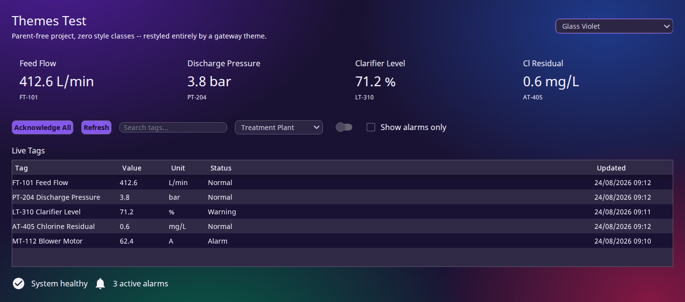
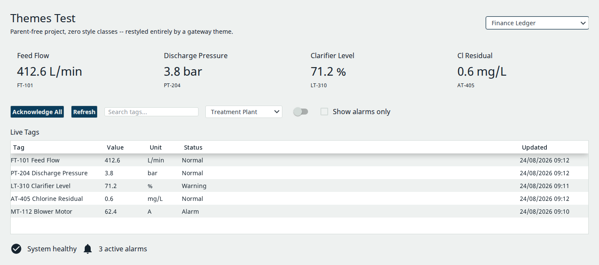
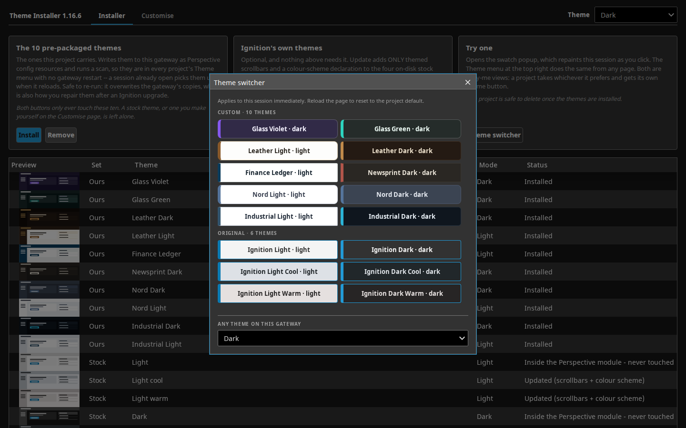
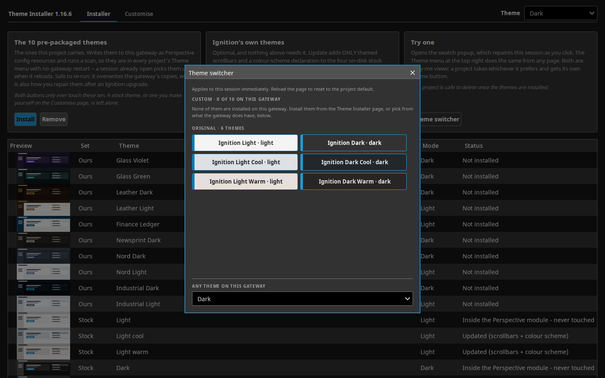

# Ignition Themes — ten Perspective gateway themes

Stock Ignition gives a Perspective session six themes, all variations on the
same two. This project adds ten more as native gateway config resources, so
they restyle every stock component on every project on the gateway with no
parent project, no project stylesheet and no style classes required.

> **Not an Inductive Automation product, and not supported by Inductive Automation.** Independent work, largely built with AI tools and tested for one purpose on a limited subset of gateway versions and platforms. Take the ideas; fork and review it before it goes near production. Feedback is welcome in Issues; improvements are made where possible, but no support is guaranteed. [NOTICE.md](NOTICE.md) says more.

## Why this exists

A look and feel that every project on a gateway should share is normally a
parent project every consumer must inherit. A theme is a gateway config
resource instead — it reaches every project without anyone inheriting
anything, and it installs by copying a folder of CSS and running a config scan.

## What it looks like

| Glass Violet | Newsprint Dark | Finance Ledger |
|---|---|---|
|  |  |  |

Three of the ten themes, each restyling the same stock components.



The copy-me swatch popup, listing the themes installed on the gateway it is
running on rather than a fixed list.



The same popup on a gateway with none of these themes installed — it offers
that gateway's own themes instead of an id it cannot resolve.

## What it does

| Theme id | Label | Look | Mode |
| --- | --- | --- | --- |
| `glass-violet` | Glass Violet | translucent glass panels over a violet/blue/green/pink gradient field | dark |
| `glass-green` | Glass Green | translucent glass over a near-black green/teal field, bright mint accent | dark |
| `leather-dark` | Leather Dark | warm tan leather and dark paper — a book after dark | dark |
| `leather-light` | Leather Light | warm tan leather and parchment — a book in daylight | light |
| `finance-ledger` | Finance Ledger | clean, restrained ledger/spreadsheet look | light |
| `newsprint-dark` | Newsprint Dark | newsprint greys and ink on a dark page | dark |
| `nord-dark` | Nord Dark | the Nord palette, dark mode | dark |
| `nord-light` | Nord Light | the Nord palette, light mode | light |
| `industrial-dark` | Industrial Dark | industrial control-room cyan, dark mode | dark |
| `industrial-light` | Industrial Light | industrial control-room cyan, day mode | light |

Each theme covers 110 of the gateway's 120 built-in theme variables, not just
the headline colours, and declares `color-scheme` for its own mode so
Chrome's auto dark mode does not repaint chart SVGs white. Each also publishes
a 69-class `st/...` style-class contract a project can build on without a
parent project — see [docs/INTERNALS.md](docs/INTERNALS.md#the-style-class-contract).

Every theme meets WCAG 2.1 AA colour contrast for text and control edges,
draws a 2px keyboard focus ring, and honours the operating system's reduced
motion setting. The build fails if a theme drops below the thresholds — see
[docs/INTERNALS.md](docs/INTERNALS.md#accessibility).

`out/themes.json` carries the same theme list as data (`id`, `label`, `dark`,
`source_pack`) for anything that wants to build a picker from it.

## How to use it

### Install

The easiest way is the
[Toolbox Theme Manager](https://github.com/Gaskony-Ignition/toolbox-theme-manager)
project, which installs any or all of the ten from a page, with no shell access
and no separate scan.

Or install the files directly — `./install.sh --data-dir`,
`--docker <container>` or `--ssh <host> --data-dir` — to inspect or script the
install without a Gateway UI round-trip, or to deploy to several gateways from
one place. See [docs/INTERNALS.md](docs/INTERNALS.md#installing-the-files-by-hand).

Themes are gateway **config resources**, not project resources, so they
register through **Config → Platform → Overview → "Scan File System"** — a
different button from the Projects page's own scan, which will not pick up a
new theme. No gateway restart is required.

### Select a theme

A session's theme is `session.props.theme` — bindable and session-wide, as
opposed to the page-scoped `system.perspective.setTheme()`. Bind a dropdown to
it, build the options from `out/themes.json`, or use one of the two copy-me
switchers in `selector-popup/`: `ThemeDropdown` (a 34px dropdown) and
`SelectorPopup` (a swatch-grid popup). Both list what the
gateway has rather than what this repo ships. See
[selector-popup/README.md](selector-popup/README.md) for how to embed either
one in another project.

---

## Building from source

```bash
python3 build_theme.py       # regenerate out/ (always wipes + rebuilds)
./package.sh                 # -> dist/ignition-themes-<VERSION>.zip
```

No third-party dependencies — the chart-scale generator uses only the
standard library. `build_theme.py` wipes and rewrites everything under `out/`,
so a rename can never leave a stale directory under an old theme id sitting
beside the new one. It prints a `WARNING` line for any mapping entry that
needed a fallback or produced a low-contrast chart colour, a `TWEAK` line per
theme listing overridden variables, and a `SWATCH` line per theme with its ten
`--qual-*` hex values, and an `A11Y` line for every colour it moved to reach
a contrast threshold. It exits non-zero only on a hard error in the mapping
itself. `tools/check_contrast.py` checks the generated themes against WCAG 2.1
AA; `tools/check_alarm_contrast.py` does the same for each alarm severity's
text, time and badge against that row's own rendered background; `package.sh`
runs both and refuses to package on a failure.

`VERSION` is a plain one-line file, bumped by hand before packaging; `package.sh`
does not touch it. `package.sh` refuses to run if `out/` or `out/themes.json`
is missing, rather than silently packaging a stale or empty `dist/`. It also runs the repo's
README/tree gate first; bypass deliberately with `--skip-readme-check`.

## Boundaries

Worth knowing before you adopt these, and none of it is fixable from a theme:

- **Elevation is one shadow across five slots.** `--boxShadow1..5` all take a
  single value, and `none` for the packs that declare no shadow token at all
  (`leather-dark`, `industrial-dark`, `industrial-light` — deliberate in
  leather's case, which reads as a flat page rather than a dashboard with
  elevation). `--boxShadow--inset` inherits the same limitation. No source
  pack defines a finer 1–5 elevation scale to derive from.
- **A heading serif face is unreachable.** Leather's Crimson Pro/Georgia
  heading face has no path to Perspective's `ia.display.label` components from
  a theme alone — confirmed against the live DOM, where `ia.display.label`
  always renders as `<div class="ia_labelComponent"><span>` and never a
  semantic heading element.
- **The Equipment Schedule / Gantt component is entirely hard-coded.** Its
  progress bar fill and track, tooltip, schedule-event blocks, lead-time
  shading, move and selected placeholders, downtime and break-period washes
  are all fixed colours regardless of theme. If your project uses it, expect
  it to look the same IA purple/blue/peach under every theme here, and under
  the stock ones too.
- **Other lower-traffic hard-codes are left as IA constants**: generic black
  elevation shadows across alarm table panels, the pager, table head and foot
  containers, the toggle-switch thumb, editable table cells and form tooltips
  (neutral black in IA's own themes too, so consistent with everything else);
  the date-range picker's day-hover tint;
  `.ia_form__actionBar--fixed`'s hairline border; and the video player's
  control-popup background, which is deliberately black to match the
  convention most video players use regardless of surrounding theme.

## Upgrade risk

Custom-named themes are low risk: the Perspective module's upgrade migrator
only manages the bundled names (`light`, `dark`, and the four shipped
variants) and never touches a custom directory. A theme installed here lives
only on the gateway it was installed to, unless you also keep a copy
elsewhere — git, a backup, or a release zip.

## Licence

Apache-2.0. See [LICENSE](LICENSE).
